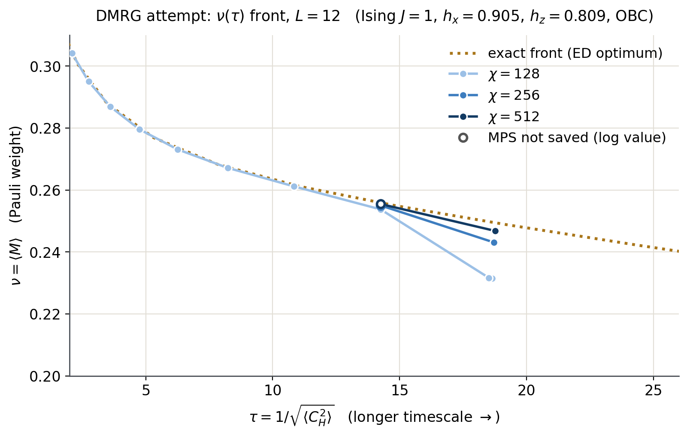
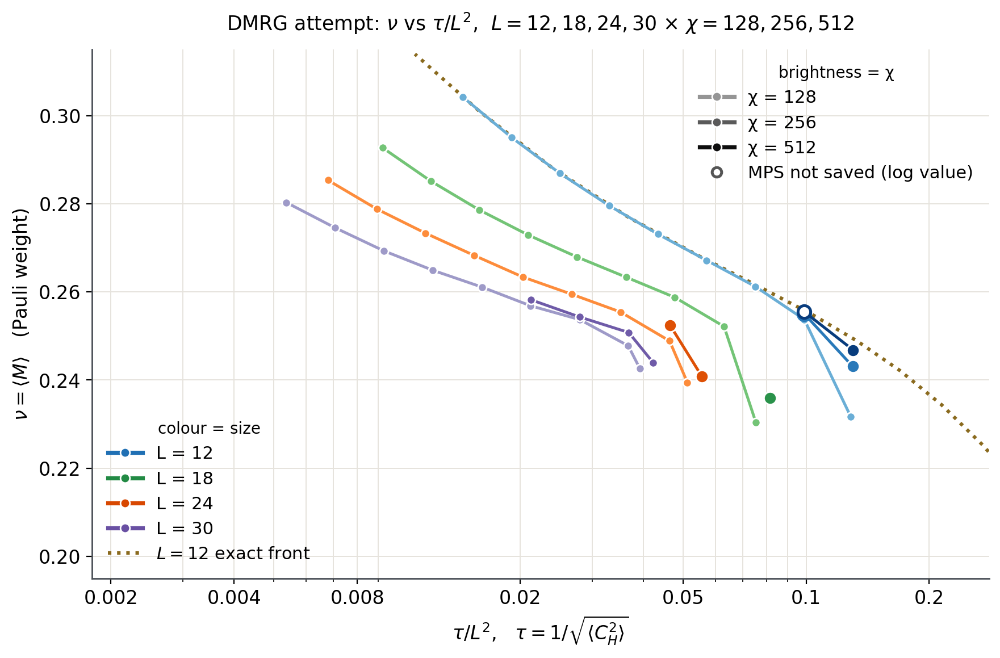

# DMRG / MPS attempt at the simple-slow-operator frontier (unsuccessful)

**Status: documented negative result, not a paper figure.** This note records a
variational tensor-network approach to the ν(τ) frontier of simple slow operators
that was developed, run at L = 12–30, and abandoned. It reproduces the exact frontier
at short times (τ ≲ 14 at L = 12) but runs into a bond-dimension ("χ") wall before
reaching the long-time regime the paper is about, and increasing χ moves the wall only
marginally at large cost. Code: `julia/SlowopDMRG/` (a clean port of the original
`MPS-Con-DMRG-Julia` package). Figures: `figures/attempt_dmrg_L12.png`,
`figures/attempt_dmrg_multiL_tauOverL2.png`.

## 1. The variational problem

Operators on L qubits are vectors in the 4^L-dimensional Pauli-string space
(Hilbert–Schmidt inner product) and are stored as an MPS with local basis
{I, X, Y, Z}. For a Hamiltonian H define

* the commutator superoperator `C_H = H_L − H_R`, `C_H O = [H, O]` (an MPO of bond
  dimension 5 for the Ising chain);
* the "simplicity" weight `M = ⊗_i diag(1, 1/3, 1/3, 1/3)`, i.e. a Pauli string of
  weight w has `M = 3^{-w}`.

For a normalized operator O, `ν = ⟨O|M|O⟩` and `⟨C_H²⟩ = ‖[H,O]‖²`, and τ = 1/√⟨C_H²⟩
(static-Hamiltonian convention, as in `sso.nutau`). The frontier is

    ν*(ε) = max ⟨O|M|O⟩   s.t.   ⟨O|C_H²|O⟩ ≤ ε,   ⟨O|O⟩ = 1,   O ⊥ {I, H, H², H³},

traced by walking ε down, τ = 1/√ε. Model throughout: Ising
`H = Σ Z_iZ_{i+1} + 0.905 Σ X_i + 0.809 Σ Z_i`, open boundary conditions. The exact
reference at L = 12 is the full-space OBC soft solver (now the `sso.nutau`
full-space OBC soft solver; originally `MPS-Concentration/compute/NuTau_ds_soft.py
--model=Ising --J=1.0 --hx=0.905 --hz=0.809 --obc --Lmin=12 --Lmax=12 --pows_max=3
--k_save=2 --lam=0.0 --theta_min=0.1 --theta_max=100 --theta_num=21`), whose leading
eigenpair at each multiplier θ gives a frontier point (`As[0]`, `Bs[0]`) =
(⟨C_H²⟩, ν).

## 2. Algorithm (`julia/SlowopDMRG`)

* **Two-site DMRG on operator space** (`dmrg_sweeps!`, `src/core/dmrg_sweeper.jl`).
  Environments hold M (single layer) and C_H² as a 4-legged tensor built from two
  *un-squared* C_H layers (`C†C`, so the Floquet variant with non-Hermitian
  `C_U = 𝒰 − 1` works with an explicit adjoint top layer). Orthogonality to the tower
  {I, H, H², H³} (MPS built by repeated `H_L`) is enforced per block by projecting
  the block onto the complement of the tower's local images (modified Gram–Schmidt).
* **ε-constrained scheduling** (`local_step_qcqp`, `src/core/local_qcqp.jl`). At each
  two-site block the local problem is a QCQP: maximize ⟨x|M̃|x⟩ subject to
  ⟨x|C̃²|x⟩ = ε (tight). θ² is its Lagrange multiplier, carried from block to block
  and located by a safeguarded log-log secant (model ⟨C²⟩ ∝ (θ²)^{-s}, slope EMA
  carried across blocks), falling back to bisection on a straddle; tolerance
  `bisect_tol = 5e-3`; warm-start acceptance window `warm_accept_tol` 0.1, tightened
  sweep by sweep to 5e-3 as ⟨M⟩ converges; ceiling `θ²_max = 1e14`. An EMA
  (α = 0.1) of θ² seeds the next ε step.
* **Inner solve** (`local_solver = :lobpcg`): the generalized problem
  `−M v = λ (I + θ² C_H²) v` on the block (spectrum bounded by ‖M‖ for any θ²), solved
  by LOBPCG with a degree-2…8 Chebyshev approximation of `(I + θ²C_H²)^{-1}` as
  preconditioner (degree adaptive in κ = 1 + 1.2 θ² λ_max, λ_max from 10 power
  iterations), in bursts of 12 iterations × ≤ 8 restarts with a *relative* Ritz
  residual test 1e-6 (LOBPCG's own absolute test is meaningless at large θ²). The
  alternative primitives `:geneig` (KrylovKit generalized eigensolve) and `:eigsolve`
  (ordinary eigensolve of −M + θ²C_H², badly conditioned) and `:fixed_theta`
  scheduling are kept.
* **ε ladder** (`scripts/eps_ladder.jl`, originally `ed_compare_L12_lobpcg.jl`):
  warm start `H_k = Σ_x (sin(πx/L) − c(L)) h_x`, `c(L) = cot(π/2L)/L` (exactly ⊥ H);
  ε₀ = its ⟨C_H²⟩; `ε_i = ε₀·3^{−i/2}`, i = 1..16, floor 1e-5. Each step: one
  `run_dmrg_for_size` call with `max_iter = 1`, 6 sweeps, noise 1e-6 → 1e-10,
  `num_ortho = 3`, `krylovdim = 30`, bond-dimension ramp 32 → 64 → χ from a cold
  start (warm-aware: 2χ_warm, 4χ_warm, cap afterwards; χ never drops below χ_warm),
  optional ε-annealing within the step (`SLOWOP_ANNEAL` sweeps, per-block geometric
  ramp from the previous ε). Step-complete checkpoints `done_stepNN.h5` and per-sweep
  `rolling_stepNN.h5` make the ladder resumable across the 24 h limit.
* **One-step drivers** (`scripts/one_step.jl`): χ refinement at the same ε
  (`SLOWOP_MODE=refine`, originally `ed_chi_refine.jl`) or one annealed ladder step at
  higher χ from a saved state (`SLOWOP_MODE=next`, originally `ed_step9_anneal.jl` /
  `ed_onestep_anneal.jl`).

## 3. What was run (series → launcher → job)

All points: `scheduling = :eps_constrained, local_solver = :lobpcg`, settings above.
Checkpoints lived in `.../DMRG_Julia/SavedMPS/hk_scan_cmp/<dir>/`; the new launchers
write the same layout under `$SSO_OUTPUT/dmrg/hk_scan_cmp/`. Reproduction commands:
`slurm/dmrg/reproduce_plotted_series.sh` (stages A–F).

| series | points used (steps) | original launcher → job(s) | new launcher | checkpoint dir |
|---|---|---|---|---|
| L=12 χ=128 | 1–10 | `ed_gpu128_anneal.slurm` task 0 (anneal=0, MAXSTEPS=10) → 13325137_0 (MIG) | `eps_ladder_mig.slurm` (stage A) | `L12_lobpcg_sinmc_repgpu128_a0` |
| L=12 χ=128 *seed* (not plotted) | 8 | `ed_L12_single.slurm` (CPU 16c) → 13102819, 13177208, 13199108 | `eps_ladder_cpu.slurm` (B) | `L12_lobpcg_sinmc_repchi128` |
| L=12 χ=256 | 8 (refine) | `ed_chi_refine_mig.slurm` → 13306156 (MIG), 4 sweeps, from seed step 8 | `one_step_mig.slurm` refine (C) | — (MPS not saved) |
| L=12 χ=256 | 9 | `ed_step9_anneal_mig.slurm` task 1 → 13312300_1 (MIG), anneal=1, from seed step 8 | `one_step_mig.slurm` next (C) | `L12_step9_anneal/step9_anneal1_chi256.h5` |
| L=12 χ=512 | 8 (refine) | `ed_step8_chi512_gpu40.slurm` → 13367090 (A100 40 GB), 6 sweeps, from seed step 8 | `one_step_gpu40.slurm` refine (C) | — (MPS not saved) |
| L=12 χ=512 | 9 | `ed_gpu512_step9.slurm` → 13325835 (A100 40 GB), ladder resumed from seed step 8 | `eps_ladder_gpu40.slurm` (D) | `L12_lobpcg_sinmc_repgpu512` |
| L=18/24/30 χ=128 | 1–9 (+ frozen 10–16) | `ed_bigL_chi128.slurm` → 13342673_{0,1,2}; resubmit 13399489_{1,2} (MIG) | `eps_ladder_mig.slurm` (E) | `L{L}_lobpcg_sinmc_repbigL{L}` |
| L=18 χ=256 | 9 (+ frozen 10–16) | `ed_L18_chi256.slurm` → 13384642 (MIG), seeded with χ=128 step 8 | `eps_ladder_mig.slurm` (F) | `..._repbigL18_chi256` |
| L=24 χ=256 | 8, 9 (+ frozen 10–16) | `ed_cont_chi256.slurm` → 13399746, 13451890 (cancelled), 13461754 (MIG), seeded with χ=128 step 7 | `eps_ladder_mig.slurm` (F) | `..._repbigL24_chi256` |
| L=30 χ=256 | 6–9 (+ frozen 10–16) | `ed_cont_chi256.slurm` → 13399747, 13451891 (cancelled), 13461755 (MIG), seeded with χ=128 step 5 | `eps_ladder_mig.slurm` (F) | `..._repbigL30_chi256` |

Annealing: L=12 χ=128 used anneal=0 (quench); the seed ladder `repchi128` predates the
annealing feature (equivalent to anneal=0); everything else anneal=1. Code: original
repo HEAD `bfc8c1f` plus uncommitted edits; two later, off-by-default experiment knobs
(`SLOWOP_EIGMIN_PRECHECK`, `SLOWOP_NO_CHI_RAMP`) were added after all plotted runs and
are not ported. **Known schedule difference:** jobs 13306156 and 13312300_1 (the two
L=12 χ=256 points) ran before commit `bfc8c1f` introduced the warm-aware χ ramp, so
their first two sweeps stayed at χ = 128 (sweeps 128, 128, 256, …); the ported code
ramps to 256 from the first sweep. For χ = 128 ladders the two schedules coincide.

## 4. Result: the χ wall

**L = 12 against the exact frontier** (relative ν gap `(ν* − ν)/ν*`, ν* interpolated
in log ε from `ed_front_L12.csv`):

| χ | step | ⟨C_H²⟩ | τ | ν | ν* | gap |
|---|---|---|---|---|---|---|
| 128 | 1–7 | 0.229 → 0.0085 | 2.1 → 10.8 | 0.304 → 0.261 | | 3e-4 – 1.6e-3 |
| 128 | 8 | 0.00492 | 14.3 | 0.2538 | 0.2558 | 0.8 % |
| 128 | 9 | 0.00292 | 18.5 | 0.2317 | 0.2497 | 7.2 % |
| 128 | 10 | 0.00288 (target 0.00164) | 18.6 | 0.2315 | 0.2495 | 7.2 % |
| 256 | 8 / 9 | 0.00492 / 0.00286 | 14.3 / 18.7 | 0.2550 / 0.2431 | | 0.3 % / 2.5 % |
| 512 | 8 / 9 | 0.00493 / 0.00284 | 14.3 / 18.8 | 0.2555 / 0.2468 | | 0.13 % / 1.0 % |

The exact L = 12 frontier continues smoothly to ⟨C_H²⟩ = 3e-5 (τ ≈ 180, ν* = 0.134),
so the constraint is feasible far below where DMRG stops; the failure is in the
variational/optimization side, not the physics.

**The wall.** Below a χ-dependent ε the per-block QCQP stops finding feasible
updates. In the L = 12 χ = 128 run (13325137_0) step 9 already shows it: blocks exit
`infeasible` / `tight_warm`, ⟨C_H²⟩ ends 2.5 % above its target and ν drops 7 % below
the front. In step 10 every block exits `ceiling_hit` (θ² pinned at 5.9e13 against the
1e14 ceiling, `frac_at_ceiling = 1.0` in the sweep summaries), ⟨C_H²⟩ stays at 0.00288
for a target of 0.00164, and every later ladder step returns the same state (the
"frozen tail": ⟨C_H²⟩ changes by < 1e-5 relative, ν by < 1e-7). Frozen values at
χ = 128: ⟨C_H²⟩ = 0.0029 / 0.0017 / 0.0011 / 0.0008 for L = 12 / 18 / 24 / 30
(τ_wall = 18.6 / 24.4 / 29.5 / 35.3, τ_wall/L ≈ 1.55 / 1.36 / 1.23 / 1.18);
χ = 256: 0.00143 / 0.00097 / 0.00069 at L = 18 / 24 / 30 (τ_wall = 26.5 / 32.1 / 38.1).
Doubling χ moves τ_wall by only ~8 %. At L = 12 the χ = 512 run reached step 9
(⟨C_H²⟩ = 0.00284, ν 1 % below the front) after 8.7 h on a full A100 and was killed by
the 23 h limit during step 10, last logged near ⟨C_H²⟩ ≈ 1.6e-3, ν ≈ 0.22 — already
~9 % below the front. The wall sits at τ/L ≈ 1.2–1.5, i.e. at the very beginning of
the regime τ ≳ L where hydrodynamic slow operators dominate, so the method never
reaches the part of the frontier that matters.

**Annealing does not fix it.** The anneal=1 χ = 128 L = 12 ladder (13325137_1) did
satisfy the step-10 constraint (⟨C_H²⟩ = 0.00164) but only by collapsing to
ν = 0.177 against ν* = 0.242 (27 % gap): it trades the θ²-ceiling freeze for a poor
operator. (The original `nutau_L12.png` spliced this point onto the anneal=0 curve;
this port does not, see §5.)

**Why this is considered unsuccessful.**
1. *It stops where the physics starts.* The DMRG front is accurate (≤ 0.2 %) only for
   τ ≲ 11 at L = 12 and leaves the exact front at τ ≈ 14–19; at every L the wall is at
   τ ≲ 1.6 L. The paper's question is the behaviour for τ ≫ L.
2. *χ buys little.* Each χ doubling moves the wall by ~8 % in τ while the step cost
   grows several-fold (χ = 256 steps take 1–28 h on a MIG slice at L = 18–30; a single
   χ = 512 step at L = 12 takes 8.7 h on a full A100). Our interpretation (not
   separately verified, e.g. by an operator-entanglement measurement) is that the
   frontier operators at τ ≳ L carry operator entanglement the χ ≤ 512 manifold cannot
   hold, so the two-site update runs out of feasible directions.
3. *The failure mode is silent and ill-conditioned.* Near the wall the multiplier is
   driven to the 1e14 ceiling, where the inner pencil −M v = λ(I + θ²C_H²)v has
   κ(B) ~ 1e14+; the sweeps stall at a fixed point rather than fail, so the result
   looks converged. The exact L = 12 front shows the constraint is feasible
   (it continues to ⟨C_H²⟩ = 3e-5), so this is not a λ_min-of-C_H² floor.
4. *Annealing / scheduling only choose which bad fixed point is reached* (quench:
   frozen at the ceiling; anneal: constraint met with a 27 % ν deficit).
5. *Cost.* The campaign used ≈ 230 h of GPU wall time (mostly MIG slices) plus
   ≈ 30 h on 16 CPU cores for points that the exact solver gives at L = 12 and that
   never reach τ ≳ 2L at any L.

## 5. Data provenance and dropped points

`data/attempt_dmrg/dmrg_points.csv` (90 rows) is built by
`scripts/extract/dmrg_points.py` from the archived HDF5 checkpoints (fields
`eps_achieved`, `nu`, `eps_target`, `theta_sq_ema`, `step`, `variant`, `timestamp`;
job assignment by timestamp vs. `sacct` start/end) and, for the two refinement points,
from the `REFINE ...` result lines of the slurm logs. Columns: `L, chi, step,
eps_target, eps, nu, theta_sq_ema, run, job, source, saved, frozen_tail, plotted,
wall_s, note`. `data/attempt_dmrg/ed_front_L12.csv` holds the 17 exact frontier points
(θ ≥ 0.3981, the range of the original figures), read lazily (`As`, `Bs` only) from
`MPS-Concentration/Ising_J1.0X0.905Z0.809OBC_DSsoft_Data/L12_theta*l0.0k2o4.npz`;
identical to the values hard-coded in the original `plot_nutau_L12.py`.

Differences from the original `plots/nutau_*.png`:

* **Dropped — killed runs.** L=12 χ=256 step 10 (job 13367089, `ed_onestep_anneal.jl`
  from the χ=256 step-9 state; timed out at 8 h mid-step) and L=12 χ=512 step 10
  (job 13325835, timed out at 23 h). The originals plotted their last-sweep log values
  (0.0016358, 0.20481) and (0.001639, 0.22158).
* **Dropped — anneal splice.** The original χ=128 L=12 curve used anneal=0 for steps
  1–9 and the anneal=1 run (13325137_1) for step 10. Now one run (13325137_0, anneal=0)
  for all ten steps; its step 10 is the wall point (0.0028754, 0.231536), as in the
  original `nutau_multiL.dat`.
* **Dropped — seed copies.** The χ=256/512 continuation directories contain the copied
  χ=128 state they were started from (L=12 step 8, L=18 step 8, L=24 step 7, L=30
  step 5). These are χ=128 results and are excluded (the original L=30 χ=256 series
  started with its seed).
* **Not plotted — frozen tails.** Ladder steps after the wall (`frozen_tail=1`) are in
  the CSV but not drawn; they lie on top of the first wall point. Exact duplicates do
  not occur in full precision; the original `nutau_multiL.dat` (6-digit rounding)
  showed them as repeated points.
* **Added.** L=24 χ=256 step 9 (0.000972187, 0.240774; saved, converged) was in the
  log but missing from the original `.dat`.
* **Kept, flagged.** L=12 χ=256 and χ=512 step 8 come from completed χ-refinement runs
  that did not write their MPS (`save_mps=false`); values from the logs (6 significant
  digits), drawn with hollow markers, `saved=0` in the CSV.
* Note the L=12 χ=256/512 points are independent one-step runs from the CPU χ=128
  ladder `repchi128` (step 8: ⟨C_H²⟩ = 0.00491858, ν = 0.253748), not from the plotted
  χ=128 curve (step 8: 0.00492178, 0.253759); the two χ=128 ladders agree to < 1e-3
  relative in both ⟨C_H²⟩ and ν through step 8.

## 6. Reproduction cost and hardware

Production: Princeton Della, Julia 1.10.2, ITensors 0.7.13 / ITensorMPS 0.3.6 /
NDTensors 0.3.74 / KrylovKit 0.8.3 / IterativeSolvers 0.9.4 (pinned in
`julia/SlowopDMRG/Manifest.toml`), CUDA.jl 5.8.3 from the shared global environment
(weak dependency, see `julia/SlowopDMRG/README.md`). Wall time per series (sum of
`wall_s`, excludes startup and timed-out partial steps):

| series | hardware | wall |
|---|---|---|
| L=12 χ=128, steps 1–10 | 1 MIG slice | 6.3 h |
| L=12 χ=128 seed (`repchi128`), steps 1–8 | 16 CPU cores | ≈ 29 h (3 jobs) |
| L=12 χ=256 step 8 / step 9 | MIG | 1.5 h / 4.4 h |
| L=12 χ=512 step 8 / step 9 | A100 40 GB | 2.5 h / 8.7 h |
| L=18 / 24 / 30 χ=128, 16 steps | MIG | 15.9 / 29.1 / 37.6 h |
| L=18 / 24 / 30 χ=256 continuation | MIG | 8.5 / 27.5 / 85.1 h |

Frozen-tail steps cost 5–40 min each; the ported ladder stops after the first frozen
step (`SLOWOP_STOP_AT_WALL=1`, default), which the original runs did not.

## 7. Validation of the port

* `julia/SlowopDMRG/test/runtests.jl` on CPU (4 cores, 26 min; job 14826936):
  **54/54 pass** — LOBPCG helper unit tests (MatFreeOp, Chebyshev preconditioner
  residual vs. theory at κ = 1e2…1e6, power iteration); **L = 6 oracle**: the
  ε-constrained sweeper (`:eps_constrained × :lobpcg`, production tolerances) at exact
  bond dimension χ = 64 on a 6-step ladder from the same sin-mode warm start, against
  the exact frontier on the complement of {I, H, H², H³} (dense LAPACK): ν agrees with
  the exact ν*(ε_achieved) to ≤ 7e-11 relative, ε lands within 0.5 % of each target,
  the tower overlap stays < 1e-14, and `exact_ground_state` (the package's L ≤ 6
  solver) reproduces the same frontier points to 1e-12; L = 7 end-to-end LOBPCG smoke;
  ε-step-boundary CholQR regression. `test/rolling_resume_smoke.sh`: pass (partial-step
  resume warm-starts from `rolling_step03`; negative control falls back to step 2).
* Deeper oracle (`SLOWOP_ORACLE_STEPS=12`, job 14828785, 30 min): 72/72 pass down to
  ε₀/729 = 1.5e-3, multiplier θ² ≈ 17, still ≤ 1.3e-10 relative in ν. At exact χ the
  sweeper therefore follows the true front well into the θ² regime where the L ≥ 12
  runs stall, which supports reading the wall as a bond-dimension (variational
  manifold) effect rather than a defect of the local solver. Not tested: the
  θ² → 1e14 ceiling regime itself, and anything at truncated χ against an exact answer
  except via the L = 12 ED front in the figures.
* `scripts/one_step.jl` smoke (L = 7, both modes, CPU): runs, saves its output file.
* Short reproduction of the plotted L = 12 χ = 128 series (anneal=0, steps 1–3,
  one MIG slice, 43 min, job 14827165) against the archived log of job 13325137_0:
  identical initial state (ε₀ = 0.398823, ⟨M⟩₀ = 0.250091); ⟨M⟩ agrees to ≤ 5e-5
  relative, ⟨C_H²⟩ to ≤ 1.1e-3 (within the QCQP acceptance tolerances; per-block noise
  is unseeded, as in production). Table in `julia/SlowopDMRG/README.md`.
* Not re-run: anything at χ ≥ 256, any L > 12, the CPU ladder path at L = 12, and
  the A100 (gpu40) launchers.
